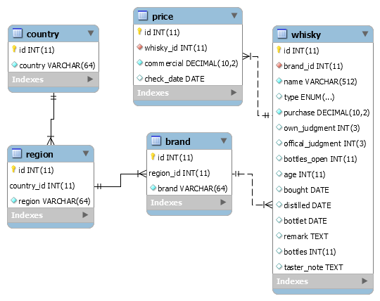

# Tag 3
| Zeit | Beschreibung | Quelle |
| --- | --- | --- |
| 45' | Finalisiere den Auftrag von letzter Woche Login/Registrierung | |
| 135' | Entwickle einen kleinen Shop mit Artikeln aus der DB und ermögliche einen Bestellprozess (Bestellung soll in DB gespeicher werden) oder Auftrag weiter unten | |
| Pause | | |
| 15' | Einleitung in Prüfung | | |
| 60' | Praktische Umsetzungsarbeit | | |
| 90' | Inputs bezüglich REGEX,Testing | | |

## Praktische Umsetzungsarbeit
Dauer: 60'  
Gewichtung: 40%  
Themen:  
- HTML, CSS, PHP, JavaScript
- PHP Basics (Funktionsweise / Prozedurale / Objektorientierung)
- Entwerfen einer Webseite (Formular)
- Implementation des Formulars
- Versenden eines Formulars (E-Mail)
- Einbau einer JavaScript Map

Wo: Am eigenen Gerät  
Abgabe: ZIP in Teams
Hilfsmittel: OpenBook

## Auftrag Alternative
Im Verzeichnis [./day3](./day3) sind 2 SQL Files vorhanden welche importiert werden können.  
Dazu ist folgendes Datenmodell mitgeliefert worden:  
  
Es handelt sich hierbei um eine Datenbank zur Hobbyverwaltung des Dozenten.
Es ist jedoch nicht vollständig, jedoch würde sich ansonsten der Aufwand zu stark erhöhen.  
Folgende Anforderungen werden an die Aufgabe gestellt:  
1. Es sollen alle Whisky in einer Tabelle ausgegeben werden
2. Es sollen alle Whisky in einer Box (je Whisky) ausgegeben werden
3. Es soll eine Filterung über die Marke möglich sein
   1. Es kann im Backend gefiltert werden oder
   2. Es kann im Frontend gefiltert werden (Allenfalls via JavaScript Library)
4. Es sollen Whisky erfasst werden können
5. Es sollen Whisky bearbeitet werden können
6. Optional:
   1. Die DB wird angepasst - Region: neues Attribut Location
   2. Die DB wird angepasst - Whisky: neues Attribut Bildpfad
   3. Bilder können bei der Whisky Erfassung hochgeladen werden
   4. Kartenausschnitt der Region wird bei der Whiskyausgabe in der Box ausgegeben
